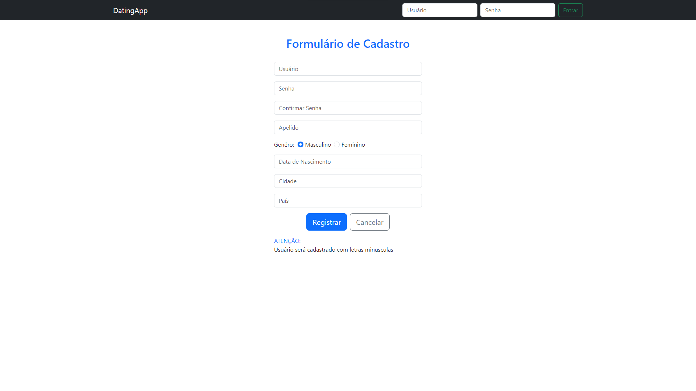
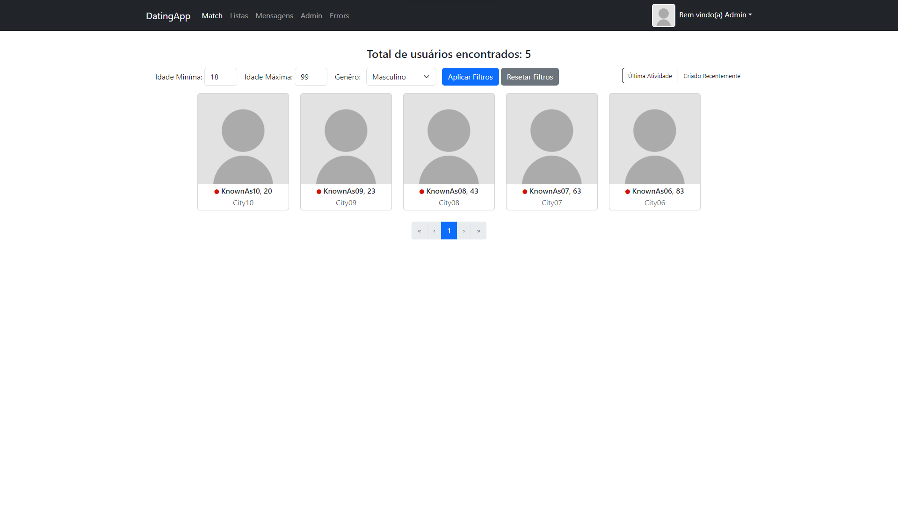
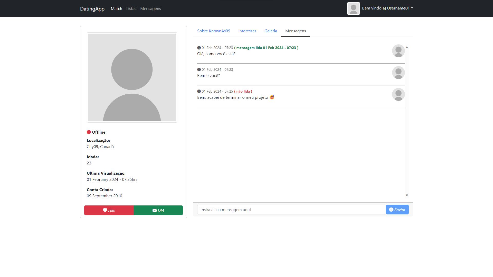

# 💌 DatingApp
O projeto apresenta uma aplicação completa que simula um aplicativo de relacionamento. Nessa plataforma, o usuário pode criar sua conta, adicionar suas fotos, curtir o perfil de outras pessoas e participar de um chat em tempo real, que indica se a mensagem foi lida ou não. Além disso, quando o usuário adiciona uma imagem, é necessária a aprovação de um administrador para que ela seja utilizada na plataforma, proporcionando assim proteção contra uso indevido.

Projeto desenvolvido com base no curso de ***Neil Cummings***


## 💻 Tecnologias

<div style="display: inline_block">
    
</div>

<br/>

## 🎯 Conceitos utilizados no projeto

Durante o desenvolvimento do projeto, foram aplicados desde conceitos fundamentais relacionados a APIs em ASP.NET como também os conceitos de Angular.

Meu principal objetivo com esse curso foi aprender o básico de Angular, já que possuia conhecimento prévio em .NET.

Alguns dos tópicos abordados foram:

- Backend
    - APIs
    - Autenticação e Autorização
    - Repository Pattern
    - AutoMapper
    - APIs de terceiro de Upload de Imagem
    - JWT Token
    - ASP.NET Identity
    - SignalR
    - UnitOfWork Pattern

- Frontend
    - Angular Cli 
    - Typescript
    - Bootstrap
    - Angular Template Forms
    - Observables
    - Rotas
    - Reactive Forms

## ⚙️ Configurações para rodar o projeto

***ATENÇÃO: Certas funções não estarão funcionando, como a de imagem, devido a necessidade de configuração da SecretKey da API de terceiro da Cloudinary, algo que só seria aplicado em um servidor em produção, devido a necessidade de sigilo da chave.***

Primeiramente será necessário configurar o docker para utilizar a imagem do SqlServer,para isso, faça o download do [Docker](https://www.docker.com/).

Após instalado no Windows WSL2, no terminal, obtenha a imagem do SqlServer para o docker através do comando:

```
docker pull mcr.microsoft.com/mssql/server
```
Agora, para configurar a imagem, utilizaremos o seguinte comando:

```
docker run -v ~/docker --name sqlserver -e "ACCEPT_EULA=Y" -e "MSSQL_SA_PASSWORD=1q2w3e4r@#$" -p 1433:1433 -d mcr.microsoft.com/mssql/server
```
Estamos com o docker configurado e prontos para prosseguir para o projeto.

Ao abrir a pasta do projeto do terminal, iremos utilizar dois comandos do dotnet para limpar os seus diretórios e "buildar" a aplicação.

```
dotnet clean
```
```
dotnet build
```

Após esses passos, iremos abrir o nosso projeto no Visual Studio Code, podendo ser aberto direto pelo aplicativo ou utilizando o shortcut 
```
code .
```

Dentro da pasta "DatingApp.API, iremos procurar o arquivo com o nome de "appsettings.Development.json". Nele, iremos inserir as seguintes configurações:

***Essas configurações são necessárias para o funcionamento da aplicação.***

```json
{
  "Logging": {
    "LogLevel": {
      "Default": "Information",
      "Microsoft.AspNetCore": "Warning"
    }
  },
  "ConnectionStrings": {
    "DefaultConnection": "Server=localhost,1433;Database=DatingApp;User ID=sa;Password=1q2w3e4r@#$;Trusted_Connection=False; TrustServerCertificate=True;"
  },
  "TokenKey": "ABCD!12345-ABCD!12345-ABCD!12345-ABCD!12345-ABCD!12345-ABCD!12345"
}
```

Com tudo pronto e salvo, estamos pronto para rodar nossa aplicação. Para isso, abra o seu terminal, dentro da pasta da API localizada dentro do projeto e execute o seguinte comando:
```
dotnet watch run
```

Espere o projeto ser construído e inicializado. Após todo esse processo, podemos entrar na aplicação. Abra o seu navegador e digite a seguinte URL:

```
https://localhost:7031
```

Pronto, você tem acesso a aplicação. Como destacado anteriormente, certas funções não estarão funcionando, como a de imagem, devido a necessidade de configuração da SecretKey da API de terceiro, algo que só seria aplicado em um servidor em produção.


## 🛡️ Dados de Seed
Durante a configuração da aplicação, dados de Seed foram criados pela aplicação para uso de testes, sendo eles:

- Admin
    - Usuário: admin
    - Senha: Pa$$w0rd1234

- Usuário
    - Usuário: username01
    - Senha: Pa$$w0rd1234


## 🚨 Erros encontrados

- Após usuário mandar ou receber uma mensagem, o horário de envio e recebimento fica no local da máquina e não no horário que vem do servidor. Pelos testes realizados, isso acontece após a conversão do horário usando o DatePipe. Caso eu retire o mesmo, ele apresenta o horário correto, porém não formatado.

- A galeria das fotos do usuário apresentada para terceiros não foi desenvolvida.

## 📷 Imagens do projeto



